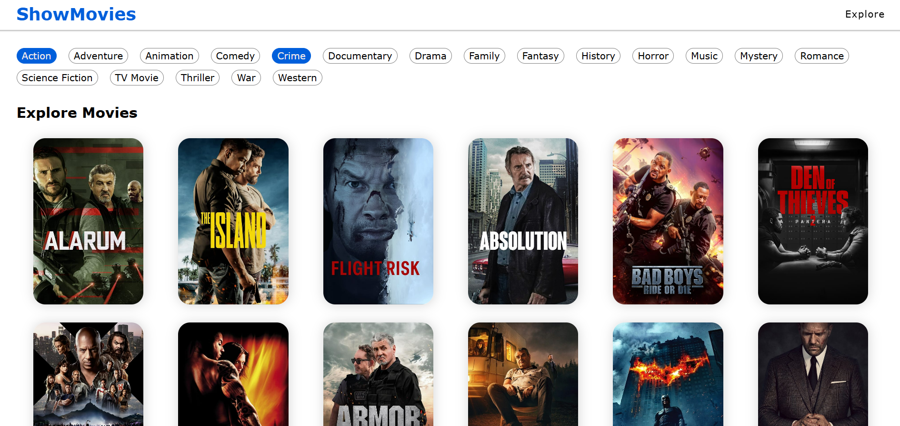

# Movie App

A simple React app to explore and view movies.

## Features

*   **Home Page:** Displays popular movies.
*   **Explore Page:** Browse more movies.
*   **Movie Page:** Shows detailed movie information.


## 💻 Live Demo:

https://movies-app-ochre-mu.vercel.app


## How it Works

This app utilizes the following technologies and concepts:

*   **React:** A JavaScript library for building user interfaces.
*   **react-router-dom:**  For navigation and routing between different pages.

The app is structured with three main routes:

*   `/` → Home (Displays popular movies)
*   `/explore` → Explore (Browse more movies)
*   `/movie/:movieId` → Movie Details (Shows detailed information for a specific movie, where `:movieId` is a dynamic parameter representing the movie's ID)

## Running the App

To run the app locally, follow these steps:

1.  **Install dependencies:**

    ```bash
    npm install
    ```

2.  **Start the app:**

    ```bash
    npm run dev
    ```

3.  **Open in browser:**

    Once the development server starts, open your web browser and navigate to `http://localhost:5173` to view the app.



##  Further Development

This section could be used for listing potential future improvements or features.  For example:

*   Implement search functionality.
*   Add user authentication and personalized movie lists.
*   Improve styling and responsiveness.
*   Integrate with a movie database API (e.g., TMDb).